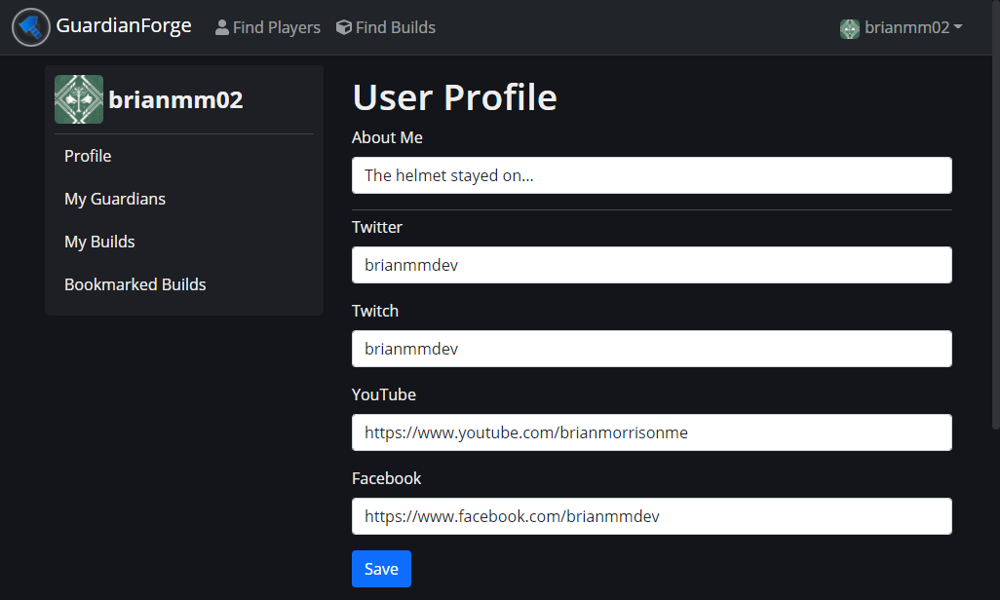
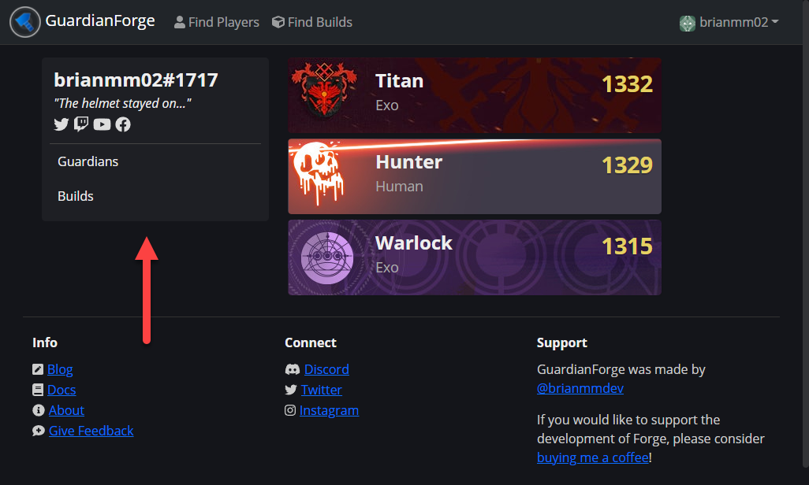
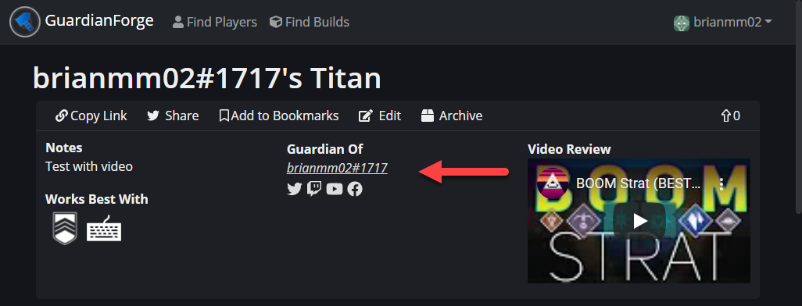
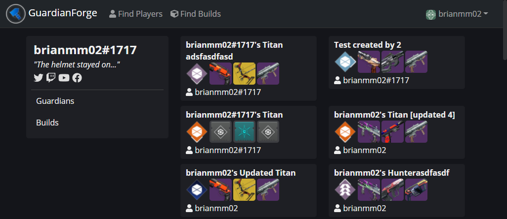

This document outlines the changes to GuardianForge that have been recently released.

Summary:

- Users can now add their social media profiles to GuardianForge accounts.
- Users can also add a snippet about themselves to be displayed to other users.
- A temporary fix to those broken images for older builds.
- Various performance optimizations have been made.

## User Profiles

If you are logged into Forge, you've had easy access to your builds, bookmarks, and Guardians for a while. There is now a new page called Profile. In the Profile view, you can add a snippet of text about you (keep it clean...) as well as links to various social media profiles. We currently support Twitter, Twitch, YouTube and Facebook. Expect more to be added over time as needed.

This information is displayed in two primary places. The first is on your public profile whenever someone searches for you via Find Users. There is now a sidebar that shows your About Me text along with icons for each of those social links you've populated. The second is in any build that has been created by you, or that someone has created from one of your Guardians.

In addition to that, if a Destiny user has signed into Forge to create builds, the builds they've created will now show next to their Guardians.

## A Fix for Broken Images

In one of the recent updates to Bungie's API, some of the image names have changed on their end, resulting in some images in Forge not displaying properly. A temporary fix is in place to resolve these, but it is currently a manual process so there may be some that were missed or they may pop up again. A more permanent fix is in the works, so expect it to be permanently resolved within the next week or two.

In the meantime, if you do find any images, join our [Discord](https://discord.gg/tctVKqXG6g) and drop a note in #support so it gets resolved ASAP.

