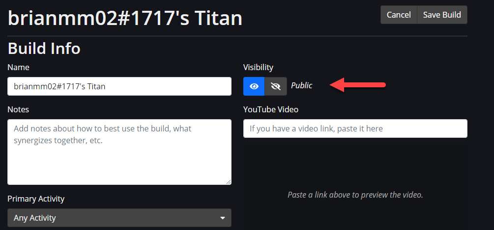
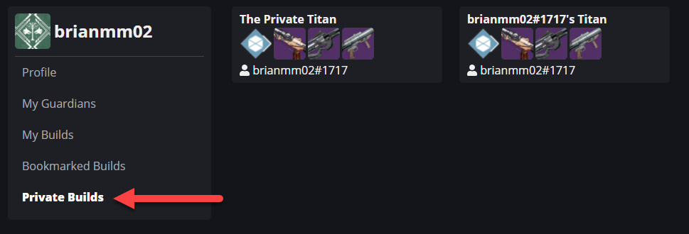
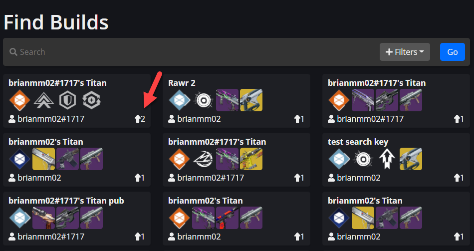
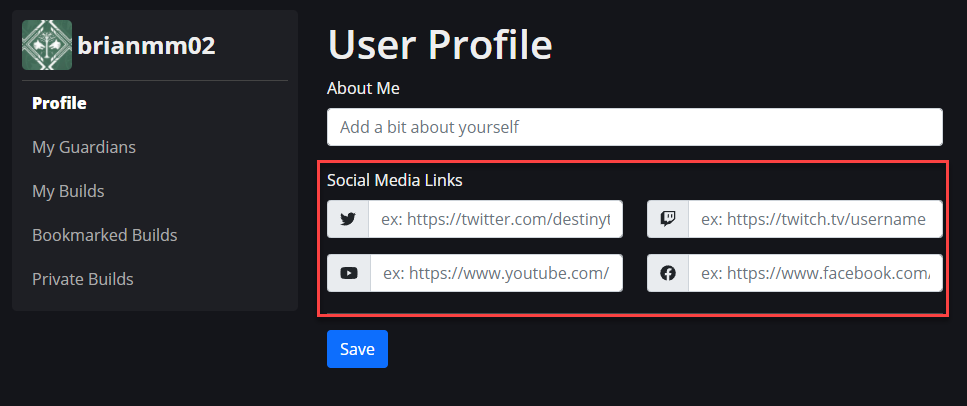

This document outlines the changes to GuardianForge that have been recently released.

Summary:

- Builds can now be private
- Profiles had a UI update
- Upvotes are now integrated into Find Builds

## Private Builds

> This feature is only available to logged in users.

Private builds has been a long-requested feature of GuardianForge. This has been implemented in the latest realease. If you are logged into GuardianForge when creating a build, there is a new toggle in the Build header that sets a build to private.

When a build is set to Private, the build will not appear on the front page under Latest Builds, nor the Find Builds search functionality.

**It is important to note that anyone with a direct link can still view the build.**

To access your private builds, there is now a new entry in your profile named Private Builds.

## Upvotes Are Integrated with 'Find Builds'

This is another enhancement that has been requested since 'Find Builds' was revamped to include more fields. Upvotes are now displayed on the Build Card in the search results. Builds that have more upvotes are automatically surfaced to the top of the list.

## Profile UI Updates

Two minor changes have been made to the profiles area.

Firstly, active links will now be boldened to indicate to users what page they are currently on.

Secondly, the Social Media links have been tweaked to reduce the amount of space they use on the screen. Icons indicate which profile link should be added to their respective fields.

>To report issues, join our [Discord](https://discord.gg/tctVKqXG6g) and drop a note in #support so it gets resolved ASAP.

